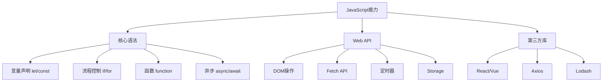

```mermaid
graph TD
    A[JavaScript能力] --> B[核心语法]
    A --> C[Web API]
    A --> D[第三方库]
    
    B --> B1[变量声明 let/const]
    B --> B2[流程控制 if/for]
    B --> B3[函数 function]
    B --> B4[异步 async/await]
    
    C --> C1[DOM操作]
    C --> C2[Fetch API]
    C --> C3[定时器]
    C --> C4[Storage]
    
    D --> D1[React/Vue]
    D --> D2[Axios]
    D --> D3[Lodash]
```

