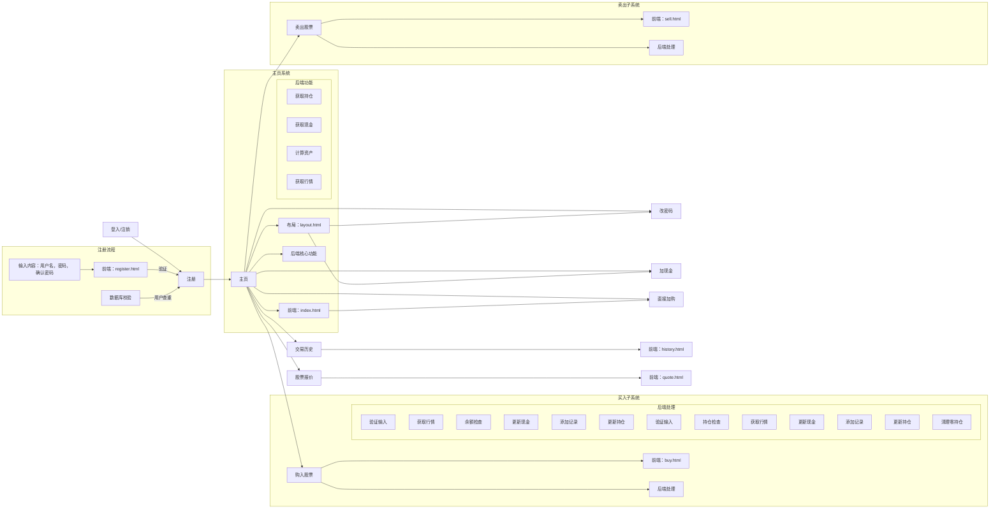

```mermaid
graph LR
    A[登入/注销] --> B[注册]
    
    subgraph 注册流程
        direction TB
        B1[前端：register.html] -->|验证| B
        B2[输入内容：用户名，密码，确认密码] --> B1
        B3[数据库校验] -->|用户查重| B
    end

    B --> C[主页]
    
    subgraph 主页系统
        direction TB
        C --> C1[前端：index.html]
        C --> C2[布局：layout.html]
        C --> C3[后端核心功能]
        
        subgraph 后端功能
            direction LR
            C31[获取持仓] 
            C32[获取现金] 
            C33[计算资产] 
            C34[获取行情]
        end
    end

    C --> D[购入股票]
    C --> E[交易历史]
    C --> F[股票报价]
    C --> G[卖出股票]
    C --> H1[改密码]
    C --> H2[加现金]
    C --> H3[直接加购]
    
    subgraph 买入子系统
        direction TB
        D --> D1[前端：buy.html]
        D --> D2[后端处理]
        
        subgraph 后端处理
            D21[验证输入]
            D22[获取行情]
            D23[余额检查]
            D24[更新现金]
            D25[添加记录]
            D26[更新持仓]
        end
    end
    
    E --> E1[前端：history.html]
    F --> F1[前端：quote.html]
    
    subgraph 卖出子系统
        direction TB
        G --> G1[前端：sell.html]
        G --> G2[后端处理]
        
        subgraph 后端处理
            G21[验证输入]
            G22[持仓检查]
            G23[获取行情]
            G24[更新现金]
            G25[添加记录]
            G26[更新持仓]
            G27[清理零持仓]
        end
    end
    
    %% 标题栏功能
    C2 --> H1
    C2 --> H2
    C1 --> H3
```
